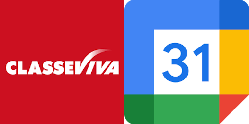

<p align="ce## 🔗 Progetto Originale

Questo progetto è un fork migliorato del repository originale:
- **Repository**: [LucaCraft89/CVVCalendarSync](https://github.com/LucaCraft89/CVVCalendarSync)
- **Autore**: LucaCraft89
- **Licenza**: GPL-3.0

## 📊 Statistiche del Progetto 
</p>

# CVVCalendarSync

[](https://www.python.org/)
[](LICENSE)
[]()

Un script Python per sincronizzare automaticamente gli eventi del registro elettronico Classeviva con Google Calendar.

## � Progetto Originale

Questo progetto è un fork migliorato del repository originale:
- **Repository**: [LucaCraft89/CVVCalendarSync](https://github.com/LucaCraft89/CVVCalendarSync)
- **Autore**: LucaCraft89
- **Licenza**: MIT

## �📊 Statistiche del Progetto

- **Lingaggi Principali**: Python
- **Linee di Codice**: 181
- **Dipendenze**: 4 (requests, google-auth, google-api-python-client, google-auth-oauthlib)
- **Compatibilità**: Linux, macOS, Windows

## ✨ Caratteristiche

- 🔄 **Sincronizzazione Automatica**: Aggiorna il calendario Google con gli eventi di Classeviva
- 🗑️ **Gestione Eventi Duplicati**: Rimuove automaticamente eventi duplicati o eliminati
- 🛡️ **Gestione Errori**: Gestisce errori API e stati temporanei (es. anno scolastico non iniziato)
- 📅 **Timezone Supportato**: Eventi sincronizzati con timezone Europe/Rome

## 📋 Prerequisiti

- Python 3.7+
- Account Google con Calendar API abilitata
- Credenziali Classeviva valide
- File di configurazione `config.json` e `credentials.json`

## 🚀 Installazione

1. **Clona il repository:**
   ```bash
   git clone https://github.com/LNLenost/CVVCalendarSync.git
   cd CVVCalendarSync
   ```

2. **Installa le dipendenze:**
   ```bash
   pip install -r requirements.txt
   ```

3. **Configura i file:**
   - Copia `config.json` e inserisci le tue credenziali Classeviva e ID calendario Google
   - Copia `credentials.json` dal tuo progetto Google Cloud Console

## ⚙️ Configurazione

### config.json
```json
{
  "user_id": "tuo_user_id_classeviva",
  "user_pass": "tua_password_classeviva",
  "calendar_id": "tuo_calendar_id_google@group.calendar.google.com",
  "credentials_file": "credentials.json"
}
```

### Google Calendar API
1. Vai su [Google Cloud Console](https://console.cloud.google.com/)
2. Crea un nuovo progetto o seleziona uno esistente
3. Abilita l'API Google Calendar
4. Crea credenziali (Service Account Key) e scarica `credentials.json`

## 📖 Utilizzo

### Esecuzione Manuale
```bash
python classevivaSync.py
```

### Output di Esempio
```
Effettuato il login con il profilo NOME COGNOME
{
    "periods": [
        {
            "dateStart": "2025-09-01",
            "dateEnd": "2025-12-31",
            ...
        }
    ]
}
Aggiungo evento: Lezione di Matematica - 2025-09-01T08:00:00+02:00 to 2025-09-01T09:00:00+02:00
```

## 🛠️ Gestione Errori

### Anno Scolastico Non Iniziato
Se l'anno scolastico non è ancora attivo, lo script mostrerà:
```
[INFO] L'anno scolastico non è ancora iniziato. Riprova quando sarà attivo nel registro elettronico.
```

### Errori di Autenticazione
- Verifica che `user_id` e `user_pass` siano corretti
- Assicurati che `credentials.json` sia valido e con permessi adeguati

### Errori API
- Controlla la connessione internet
- Verifica che l'account Classeviva sia attivo

## 📁 Struttura del Progetto

```
CVVCalendarSync/
├── classevivaSync.py    # Script principale
├── config.json          # Configurazione (non tracciato)
├── credentials.json     # Credenziali Google (non tracciato)
├── requirements.txt     # Dipendenze Python
├── Dockerfile           # Container Docker
├── compose.yml          # Docker Compose
├── LICENSE              # Licenza GPL-3.0
├── README.md            # Questa documentazione
└── .gitignore           # File da ignorare in git
```

## 🐳 Docker (Opzionale)

### Build e Run
```bash
docker build -t cvvcalendarsync .
docker run -v $(pwd)/config.json:/app/config.json -v $(pwd)/credentials.json:/app/credentials.json cvvcalendarsync
```

### Docker Compose
```bash
docker-compose up
```

## 🤝 Contributi

Contributi benvenuti! Per favore:

1. Fork il progetto
2. Crea un branch per la tua feature (`git checkout -b feature/AmazingFeature`)
3. Commit le tue modifiche (`git commit -m 'Add some AmazingFeature'`)
4. Push al branch (`git push origin feature/AmazingFeature`)
5. Apri una Pull Request

## 📝 Licenza

Questo progetto è distribuito sotto **GNU General Public License 3.0 (GPL-3.0)**.

### Cosa significa GPL-3.0:
- ✅ **Uso libero**: Puoi usare, modificare e distribuire il progetto liberamente
- ✅ **Open source obbligatorio**: Qualsiasi modifica o derivato deve rimanere open source
- ✅ **No sfruttamento commerciale**: Nessuno può commercializzare il progetto senza condividere il codice
- ✅ **Attribuzione richiesta**: Devi riconoscere il lavoro originale

Vedi il file `LICENSE` per i termini completi della licenza.

## ⚠️ Disclaimer

Questo progetto non è ufficialmente affiliato con Classeviva o Google. Utilizzalo a tuo rischio. Assicurati di rispettare i termini di servizio di entrambi i servizi.

## 📞 Supporto

Se hai problemi:
1. Controlla i log di output dello script
2. Verifica la configurazione
3. Apri una issue su GitHub o scrivimi su Discord: @LNLenost

---

⭐ Se questo progetto ti è utile, considera di mettere una stella!
